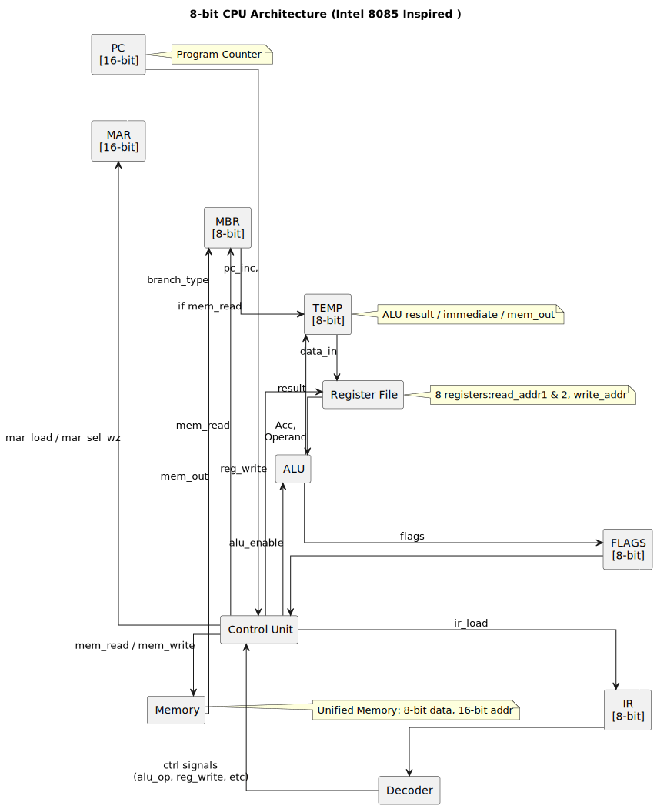

# 8-bit CPU in Verilog (Inspired by Intel 8085)

A Verilog implementation of a simple 8-bit CPU inspired by the Intel 8085 microprocessor. This project demonstrates foundational CPU architecture, instruction decoding, control flow, and pipelining.

---

## Features

* 8-bit data bus, 16-bit address bus
* General-purpose register file
* ALU with arithmetic, logical, rotate, and compare operations
* Instruction decoding and pipeline execution
* Support for immediate and direct memory access
* Branching with condition evaluation
* Memory read/write support

---

## Architecture Overview

The top-level `CPU` module instantiates:

* **Program Counter (PC):** 16-bit, holds next instruction address
* **Instruction Register (IR):** Holds current opcode
* **Memory Address Register (MAR):** Holds target memory address
* **Memory Buffer Register (MBR):** 8-bit, buffers data from/to memory
* **General Registers:** 8-bit wide, accessed via 3-bit addresses
* **W/Z Registers:** Temporary registers for holding operands
* **Arithmetic Logic Unit (ALU):** Handles all arithmetic/logical operations
* **Flags Register:** Stores Zero, Carry, Sign, Parity, etc.
* **Decoder:** Decodes instructions, sends control signals
* **Control Unit:** Implements pipeline and control flow logic
* **Memory:** Simulates addressable main memory

---

##  Instruction Pipeline

The Control Unit runs a multi-cycle FSM with the following states:

* **FETCH:** Load instruction from memory via `PC → MAR → IR`
* **DECODE:** Analyze `IR` and determine next steps
* **FETCH\_OP1 / FETCH\_OP2:** Load operands for 2/3-byte instructions
* **MEM\_RD:** Read memory content into operand registers
* **EXEC:** Trigger ALU operations
* **WB (Write Back):** Write result back to register or memory
* **HALT:** Stop execution

---

##  Instruction Set Summary

### ALU Operations (`alu_opcode`)

| Opcode | Mnemonic | Operation                  |
| ------ | -------- | -------------------------- |
| 00000  | AND      | Logical AND                |
| 00010  | OR       | Logical OR                 |
| 00011  | XOR      | Logical XOR                |
| 00100  | ADD      | Add                        |
| 00101  | ADC      | Add with Carry             |
| 00110  | SUB      | Subtract                   |
| 00111  | SBB      | Subtract with Borrow       |
| 01000  | INR      | Increment Register         |
| 01001  | DCR      | Decrement Register         |
| 01010  | ROL      | Rotate Left                |
| 01011  | ROR      | Rotate Right               |
| 01100  | RLC      | Rotate Left through Carry  |
| 01101  | RRC      | Rotate Right through Carry |
| 01110  | CMP      | Compare                    |
| 00001  | CMA      | Complement Accumulator     |
| 11111  | NOP      | No Operation               |

### Common Instructions

| Mnemonic | Opcode         | Description                            |
| -------- | -------------- | -------------------------------------- |
| MOV      | `01ddsss`      | Copy source register to destination    |
| MVI      | `00rrr110`     | Load 8-bit immediate to register       |
| LDA      | `0x3A`         | Load A from memory\[16-bit address]    |
| STA      | `0x32`         | Store A into memory\[16-bit address]   |
| INR/DCR  | `00rrr100/101` | Increment/Decrement register           |
| RLC/RRC  | `0x07/0x0F`    | Rotate left/right through carry (on A) |
| CMA      | `0x2F`         | Complement A                           |
| HLT      | `0x76`         | Halt CPU execution                     |

### Branch Instructions

| Mnemonic | Opcode      | Condition                   |
| -------- | ----------- | --------------------------- |
| JMP      | `0xC3`      | Unconditional               |
| JZ/JNZ   | `0xCA/0xC2` | Zero flag set/unset         |
| JC/JNC   | `0xDA/0xD2` | Carry flag set/unset        |
| JP/JM    | `0xF2/0xFA` | Sign flag positive/negative |
| JPE/JPO  | `0xEA/0xE2` | Parity even/odd             |

---

##  Modules

| Module        | Function                                      |
| ------------- | --------------------------------------------- |
| `CPU`         | Top-level integration of all components       |
| `Register`    | General-purpose register file                 |
| `ALU`         | Performs all arithmetic/logical ops           |
| `Memory`      | Read/write memory access                      |
| `Decoder`     | Decodes `IR` and outputs control signals      |
| `ControlUnit` | FSM that controls fetch-decode-execute stages |

---

##  Getting Started

### Requirements

* **Simulator:** Icarus Verilog

### Steps

1. **Clone Repo**

   ```bash
   git clone https://github.com/Abhishek5211/FPGA
   cd ./FPGA/MP_8-bit
   ```

2. **Simulate (Icarus Verilog)**

   ```bash
   iverilog -o cpu_sim *.v
   vvp cpu_sim
   gtkwave cpu_tb.vcd
   ```
 

